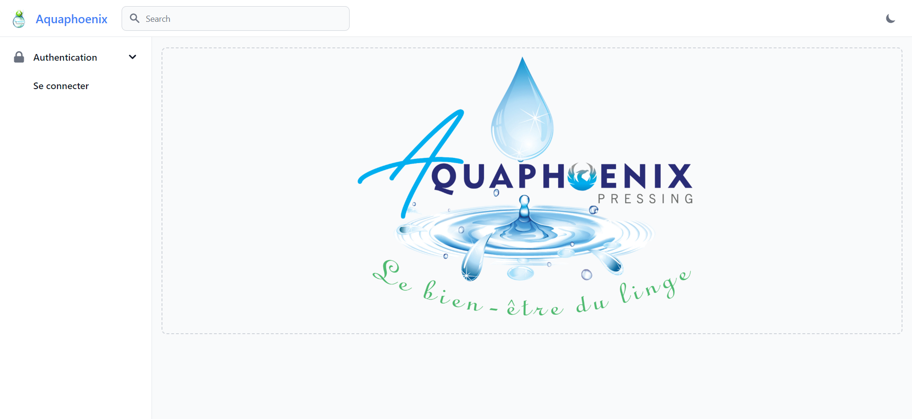
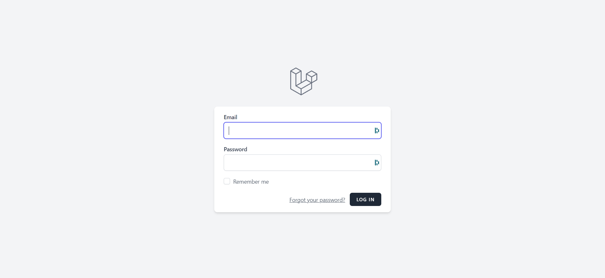
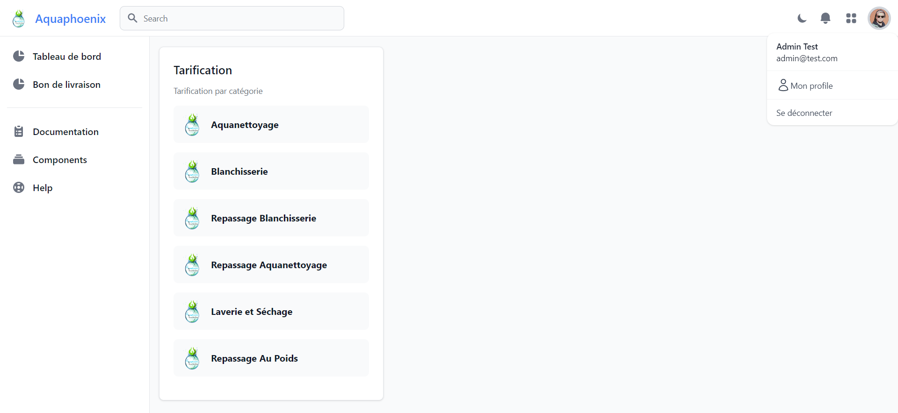

# Guide de Connexion à Votre Compte

Bienvenue dans le guide d'accès à votre compte sur le tableau de bord Aquaphoenix ! Ce guide a été conçu spécialement pour les nouveaux utilisateurs, afin de vous accompagner étape par étape dans le processus de connexion à votre compte au sein de notre plateforme. Suivez attentivement les instructions ci-dessous pour accéder à votre compte de manière simple et efficace.

## Étapes pour Se Connecter à Votre Compte :

1. **Accédez à la Page de Connexion :**
Ouvrez votre navigateur web et entrez l'URL de l'application Laravel Breeze dans la barre d'adresse. Habituellement, l'URL ressemblera à quelque chose comme : https://aquaphoenix.jsprod.fr/login. Appuyez sur "Entrée" pour accéder à la page de connexion.

2. **Remplissez vos Identifiants :**
Sur la page de connexion, vous verrez des champs vides pour "Adresse e-mail" et "Mot de passe". Entrez l'adresse e-mail associée à votre compte dans le champ approprié. Assurez-vous d'entrer l'adresse e-mail exacte que vous avez utilisée lors de la création de votre compte. Ensuite, saisissez votre mot de passe dans le champ "Mot de passe".

3. **Cliquez sur le Bouton de Connexion :**
Une fois que vous avez entré vos identifiants, cliquez sur le bouton de connexion. Cela enverra vos informations au serveur pour vérification.

4. **Vérification des Informations :**
L'application vérifiera maintenant vos informations d'identification avec celles enregistrées dans la base de données. Si les informations sont correctes, vous serez redirigé vers votre tableau de bord ou votre page d'accueil connectée. Sinon, vous recevrez un message d'erreur indiquant que les informations sont incorrectes.

5. **Mot de Passe Oublié ? :**
Si vous avez oublié votre mot de passe, sur la même page de connexion, vous trouverez souvent un lien intitulé "Mot de passe oublié ?" ou quelque chose de similaire. En cliquant sur ce lien, vous pourrez réinitialiser votre mot de passe en suivant les instructions fournies.

## Problèmes de Connexion :

Si vous rencontrez des problèmes pour vous connecter à votre compte malgré avoir suivi les étapes ci-dessus, voici quelques suggestions pour résoudre le problème :

### Vérifiez vos Identifiants : 
Assurez-vous d'entrer correctement votre adresse e-mail et votre mot de passe. Les erreurs de frappe sont courantes.

### Réinitialisation du Mot de Passe : 
Si vous ne vous souvenez pas de votre mot de passe, suivez les étapes de réinitialisation de mot de passe disponibles sur la page de connexion.

### Assistance Technique : 
Si vous continuez à avoir des problèmes, contactez l'équipe d'assistance technique de l'application. Ils pourront vous guider à travers le processus de résolution des problèmes.

Félicitations ! Vous êtes désormais prêt à accéder à votre page de profil au sein du dashboard Aquaphoenix. Référez-vous à ce guide chaque fois que vous souhaitez consulter ou mettre à jour vos informations de profil. Pour toute question supplémentaire ou préoccupation, n'hésitez pas à contacter notre équipe d'assistance dédiée, prête à vous aider dans toutes vos démarches.