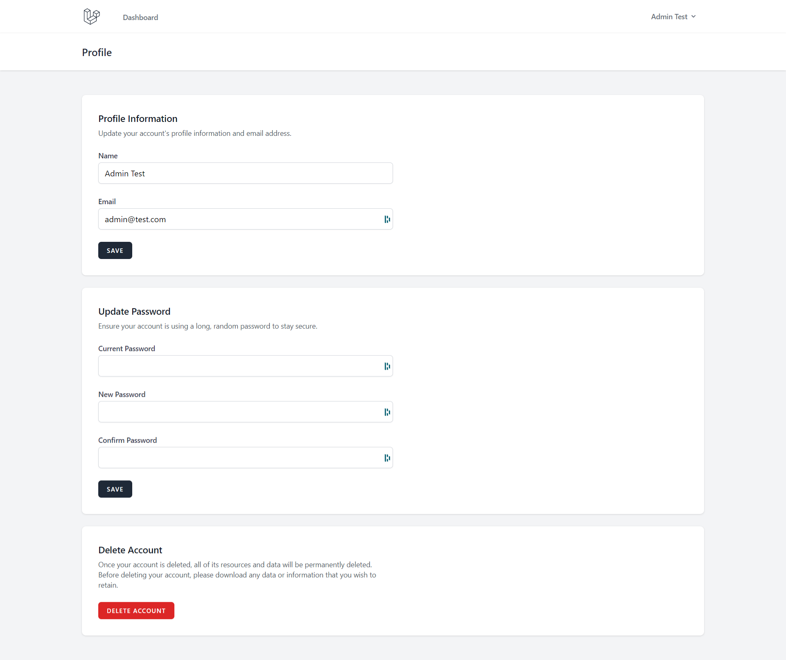

# Guide d'Accès à Votre Page de Profil - Dashboard Aquaphoenix

Bienvenue dans le guide d'accès à votre page de profil au sein du dashboard Aquaphoenix. Ce guide a été conçu pour vous, utilisateur débutant, afin de vous guider à travers les étapes nécessaires pour accéder à votre propre page de profil au sein de cette plateforme. Suivez les instructions ci-dessous pour une expérience fluide.

## Accéder à Votre Page de Profil :

1. **Connectez-vous à Votre Compte :**
Ouvrez votre navigateur web et rendez-vous sur la page de connexion du dashboard Aquaphoenix. Si vous n'êtes pas déjà connecté, entrez vos informations d'identification dans les champs correspondants, puis cliquez sur le bouton de connexion.

2. **Naviguez vers Votre Profil :**
Après vous être connecté avec succès, vous serez redirigé vers votre tableau de bord ou votre page d'accueil personnalisée. Recherchez le lien ou le bouton qui vous permettra d'accéder à votre page de profil. Ce lien est généralement affiché dans un coin supérieur de l'interface utilisateur et peut être étiqueté "Mon Profil", "Profil Utilisateur", ou quelque chose de similaire. Cliquez sur ce lien pour accéder à votre page de profil.

3. **Exploration de Votre Profil :**
Une fois sur votre page de profil, vous pourrez afficher et mettre à jour diverses informations vous concernant. Cela peut inclure votre nom, votre adresse e-mail, une photo de profil et d'autres détails pertinents. En fonction des fonctionnalités du dashboard, vous pourriez également avoir la possibilité de modifier votre mot de passe, de gérer vos préférences ou d'effectuer d'autres actions liées à votre compte.

4. **Mises à Jour et Personnalisation :**
Si vous souhaitez effectuer des mises à jour sur votre profil, cherchez les options d'édition correspondantes sur la page. Si vous voulez changer votre photo de profil, votre adresse e-mail ou d'autres détails, assurez-vous de sauvegarder vos modifications en suivant les instructions fournies.

## Problèmes d'Accès à Votre Profil :
Si vous rencontrez des difficultés pour accéder à votre page de profil, voici quelques suggestions pour résoudre le problème :

### Vérifiez votre Connexion :
Assurez-vous d'être correctement connecté à votre compte en utilisant vos identifiants.

### Assistance Technique : 
Si vous continuez à avoir des problèmes, contactez l'équipe d'assistance technique de l'application. Ils pourront vous guider à travers le processus de résolution des problèmes.

Félicitations ! Vous disposez désormais des instructions nécessaires pour accéder à votre page de profil au sein du dashboard Aquaphoenix. Utilisez ce guide chaque fois que vous souhaitez consulter ou mettre à jour vos informations de profil. Si vous avez des questions supplémentaires, n'hésitez pas à contacter le support du dashboard.